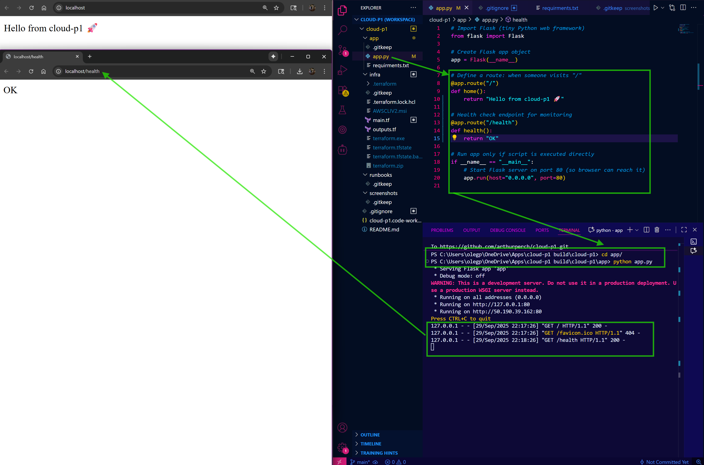
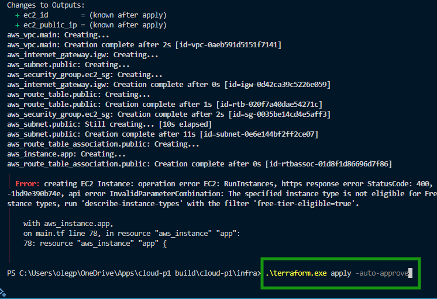
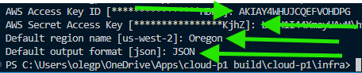
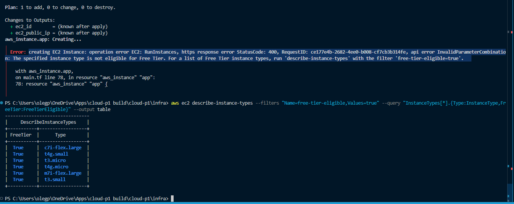

# Cloud Infrastructure with Flask App

End-to-end AWS project deploying a 3-tier Flask application with Terraform.  
Built to demonstrate real-world cloud engineering practices including Infrastructure as Code (IaC), application deployment, monitoring, and security hardening.  

---

## 🌐 Current Status  

- ✅ Infrastructure deployed via Terraform (VPC, subnet, IGW, security group, EC2)  
- ✅ EC2 instance running Amazon Linux 2, accessible via SSH and HTTP  
- ✅ Flask app created and tested locally with `/` and `/health` endpoints  
- 🔄 Next: Deploy Flask app onto EC2 instance  

---

## 📸 Screenshots  

### Local Flask App  
Visit:  
- [http://localhost:80](http://localhost:80)  
- [http://localhost:80/health](http://localhost:80/health)  

### Flask Local Test  



---

### AWS EC2 Instance Running  


---

### Architecture Diagram  


---


### Terraform Apply Success  


### AWS CLI Configure  


### EC2 Free Tier Check  


## 🐍 Flask Application  

Endpoints:  
- `/` → **Hello from cloud-p1 🚀**  
- `/health` → **OK**  

<details>
<summary>app.py (click to expand)</summary>

```python
from flask import Flask

app = Flask(__name__)

@app.route("/")
def home():
    return "Hello from cloud-p1 🚀"

@app.route("/health")
def health():
    return "OK"

if __name__ == "__main__":
    app.run(host="0.0.0.0", port=80)
